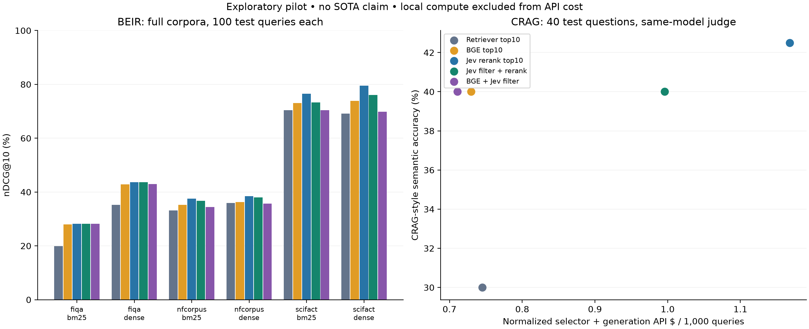

# Ecosystem pilot results

This is a small exploratory pilot, not a SOTA or universal-improvement claim. All five policies, datasets and query samples were fixed before paid evaluation.

Recorded API usage cost: **$0.6546** of the $25 ceiling. **$24.3454 remains**; 0 unreconciled requests. This is usage-based accounting, not a vendor invoice. Local compute cost is unknown.
[Spend breakdown](spend-summary.json) separates selection, generation, evaluation and live integration checks. The $25 limit is a ceiling, not a spending target.

## Full-corpus BEIR retrieval

nDCG@10, percent. 100 test queries per dataset, identical queries across retrievers. The corpora are complete; the query sets are sampled. SciFact is a previously exposed replication. These are retrieval metrics, not generated-answer accuracy.

| Dataset / retrieval | Original | BGE | Jev rerank | Jev filter | BGE + Jev filter |
|---|---:|---:|---:|---:|---:|
| fiqa/bm25 | 19.84 | 27.94 | 28.23 | 28.23 | 28.18 |
| fiqa/dense | 35.23 | 42.90 | 43.61 | 43.61 | 43.01 |
| nfcorpus/bm25 | 33.21 | 35.27 | 37.53 | 36.69 | 34.40 |
| nfcorpus/dense | 35.96 | 36.31 | 38.42 | 38.03 | 35.74 |
| scifact/bm25 | 70.35 | 73.07 | 76.57 | 73.33 | 70.43 |
| scifact/dense | 69.12 | 73.87 | 79.46 | 76.03 | 69.86 |

Jev reranking had a higher point estimate than BGE in 6/6 settings, but 4 of the paired intervals include zero. The two retrievers share the same test questions, so these are not six independent dataset wins.

Paired, descriptive cluster-bootstrap intervals are in [results.json](results.json). NFCorpus has only ten query clusters, including one containing 91 of the 100 queries; its interval is particularly unstable. Do not treat the 100 queries as 100 independent observations or infer a confirmatory win.

## CRAG through native FlashRAG

40 official public-test questions, five supplied search pages each, one generated answer per arm. The additional 16 validation questions are reported separately in the JSON, not mixed into this table. Semantic accuracy uses pinned CRAG prompts with a Luna judge and corrected evaluation loop; it is **not an official CRAG leaderboard result**. Generator/judge model overlap introduces bias.

| Pipeline | Answer F1 | Semantic accuracy | Wrong / abstained | Utility | Mean passages | Normalized API $/query |
|---|---:|---:|---:|---:|---:|---:|
| Retriever top10 | 14.65 | 30.0 | 8 / 20 | 0.100 | 10.00 | 0.000745 |
| BGE top10 | 20.09 | 40.0 | 8 / 16 | 0.200 | 10.00 | 0.000730 |
| Jev rerank top10 | 22.68 | 42.5 | 8 / 15 | 0.225 | 10.00 | 0.001168 |
| Jev filter + rerank | 20.03 | 40.0 | 11 / 13 | 0.125 | 7.50 | 0.000996 |
| BGE + Jev filter | 21.96 | 40.0 | 10 / 14 | 0.150 | 6.40 | 0.000711 |

Jev reranking's API cost was +56.8% versus original retrieval. Filtering reduced the context but increased incorrect-answer counts in this sample. The pilot supports testing reranking further; it does not support a universal 'better and cheaper' claim or a universal filtering threshold.

API costs include the selector and generation, normalized to uncached input prices. BGE's local computation is not free and is excluded from this monetary comparison. CRAG utility scores correct/abstained/incorrect responses as +1/0/−1. Short-answer F1 can undercount valid aliases; the two metrics should not be interchanged. No multiple-comparison-corrected superiority claim is made.

[Semantic grading and paired descriptive intervals](crag-semantic-report.json) retain all outcomes. Fewer abstentions can increase both correct and incorrect answers: evaluate utility and errors alongside accuracy. These are automated judgments, pending independent human review.

## Verification and diagnostics

- 4,997 artifact checks passed, including equality with the production selection policies and reconciliation of returned usage to the ledger.
- Two additional native FlashRAG runs executed real Jev selection and Luna generation on the same managed adapter, preserving metadata and closing its connections. These integration checks are excluded from benchmark accuracy metrics.
- Native BERGEN `Rerank.eval` reproduced 752 complete rankings (15,040 query/document pairs). This is a rerank-stage check, not the full BERGEN generation benchmark.
- Native RAGChecker evaluated 40 responses from eight paired test questions. [Metrics and extraction coverage](ragchecker-report.json) are diagnostics, not independent human judgments.
- 5 completed empty extractor responses were retained as zero claims using RefChecker's native parser. Raw traces and charges remain unchanged; no retry or invented claims. The adapter amendment and empty-extraction coverage are published explicitly.
- Model revisions, input checksums, truncation counts, local runtime and all development results are retained in the protocol and JSON reports.
- Two development questions contain numeric alternative references. A [reporting amendment](report-reference-amendment.json) converts those numbers to literal strings for EM/F1 only; test results and raw data are unchanged.
- A blinded 40-question/five-arm human review packet is available locally as `artifacts/ecosystem-v1/human-review-blinded.json`. No human adjudication has been completed or claimed.

## What remains

1. Full-Wikipedia NQ, TriviaQA and HotpotQA on a larger machine. The E5 index alone expands to 64.56 GB, plus the corpus; the compressed index is 37.28 GB.
2. Full BERGEN generation replication, additional retrievers/rerankers, and repeated generation with simultaneous confidence intervals.
3. Independent human review and a shadow trial using real production queries. Calibrate thresholds on separate development data before deployment.

[Reproduction commands and limitations](README.md) · [Frozen protocol](protocol.json) · [Per-query metrics](per-query.json)
