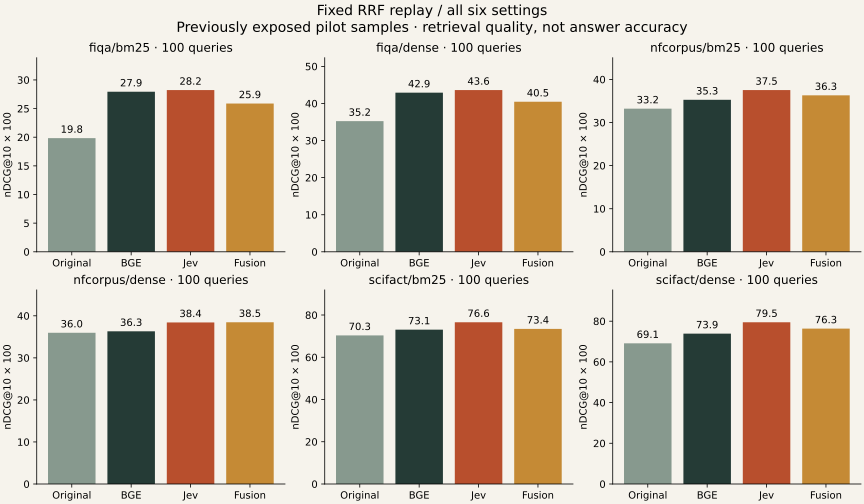

# Fusion replay: same candidates, an additional ranking signal

Post-hoc replay of all 600 evaluation query/retriever cases from ecosystem-v1. Fixed k=60, equal weights; no weight or cutoff search. No new model calls. Existing test outcomes previously examined: exploratory replication, not a new holdout.

| Dataset / retrieval | Original | BGE reranker | Jev | Fusion | Fusion − Jev (95% CI) |
|---|---:|---:|---:|---:|---:|
| fiqa/bm25 | 19.84 | 27.94 | 28.23 | 25.88 | -2.35 [-4.06, -0.82] |
| fiqa/dense | 35.23 | 42.90 | 43.61 | 40.46 | -3.15 [-5.04, -1.34] |
| nfcorpus/bm25 | 33.21 | 35.27 | 37.53 | 36.30 | -1.22 [-11.61, -0.68] |
| nfcorpus/dense | 35.96 | 36.31 | 38.42 | 38.46 | +0.04 [-0.18, +6.06] |
| scifact/bm25 | 70.35 | 73.07 | 76.57 | 73.43 | -3.14 [-6.11, -0.37] |
| scifact/dense | 69.12 | 73.87 | 79.46 | 76.34 | -3.12 [-6.10, -0.48] |

Values are graded nDCG@10 × 100, not answer accuracy.



## Interpretation and limits

Fusion preserves the original retriever signal. Whether it helps depends on that signal: averaging in a weaker ranking can reduce Jev's gains. Read all settings, not just the best case.

These are the same 100 test queries per corpus under two retrievers, not 600 independent questions. NFCorpus has only 10 connected query clusters (largest 91/100); SciFact and all pilot outcomes were previously exposed. The bootstrap intervals are descriptive and do not establish SOTA.

Full original qrels, including missing candidates, determine the denominator. No zero-hit queries were dropped. Original means custom BM25 or E5-small-v2 dense order; BGE is bge-reranker-v2-m3, not the BGE-M3 embedding model used in the independent catalog study. Jev is the original contextual Noul scorer, not that study's four-level Score rubric. This is not an exact replication of either external study.

No new inference or generated-answer benchmark was run here. API stage costs and latency are copied from the historical traces; RRF adds local arithmetic, whose production latency is not benchmarked. No claim of lower total RAG cost or better answers follows from this replay. See results.json for each arm's token, recall, cost and timing diagnostics.

## Reproduce

```sh
uv run --group benchmark python -m benchmarks.fusion.evaluate
```

The committed compressed input includes candidate IDs, human dataset qrels, scores, token counts and recorded usage. It omits passage text. SHA-256 verification precedes scoring. `--export` is for the original local ecosystem caches; it validates their fingerprints and historical code against the pinned source commit. Existing studies and frozen hashes are unchanged.

[Product integration and comparison guide](../../docs/FUSION.md)
