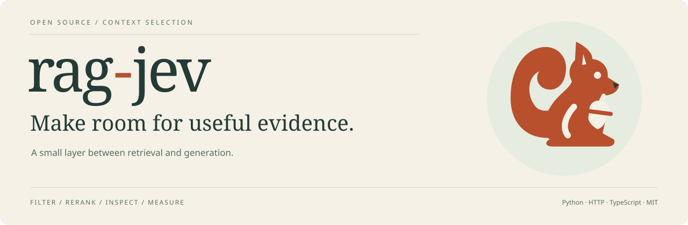

# The rag-jev identity

A squirrel keeps what is worth carrying. The mark connects that instinct to
context selection: **make room for useful evidence**. It is a mascot, not a claim
that the selector always recognizes useful evidence correctly.

| Element | Source / use |
| --- | --- |
| Squirrel | [Original SVG](../src/rag_jev/static/brand/squirrel.svg), transparent; app masthead and illustrations |
| Favicon | [SVG](../src/rag_jev/static/brand/favicon.svg), cream tile; browser tabs |
| Banner | [Self-contained SVG](../src/rag_jev/static/brand/banner.svg), 1280 × 420; repository and presentations |
| Sharing image | [PNG](../src/rag_jev/static/brand/social-preview.png), 1280 × 640; social cards and GitHub social preview |
| Russet | `#B84F2D`, mascot and emphasis |
| Forest ink | `#253B36`, text and structural elements |
| Warm paper | `#F5F1E7`, canvas |
| Sage wash | `#E6ECDF`, quiet backgrounds |
| Type | Georgia display; Trebuchet MS / sans-serif body; local fonts, no tracking requests |

Keep clear space around the squirrel; do not stretch it or add tiny detail.
Use the full-color mark on paper or a light neutral. The favicon has its own background
so it stays legible in dark browser chrome. The original artwork is included under
this repository's MIT license. It is the identity of this independent integration,
not the TypeSafe or Jev model logo; no affiliation is implied.

From a source checkout, rebuild derived SVG assets with `python scripts/build_brand.py`.
Export PNG, ICO and touch-icon formats with `uv run python scripts/export_brand.py`
(requires the Chromium installed by `make setup`). Rebuild the study
index and plots with `uv run --group benchmark python scripts/build_research_site.py`.
The latter reads [studies.json](studies.json) and the committed measurement files;
it makes no inference calls. Keep scopes and caveats beside every chart.
