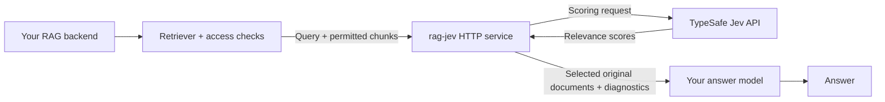

# Run rag-jev beside any RAG backend

rag-jev is a stateless context-selection service. Your retriever, access controls,
vector database and answer model stay in your application. The workbench is an
optional client of the same API; running a browser on the server is unnecessary.



Use the Python library in your existing worker, deploy the HTTP service as a sidecar,
or run multiple service replicas behind your private load balancer. No database,
shared disk or sticky sessions are required. Replays and review files are explicitly
exported by the client, not stored on the service.

## Container deployment

From this checkout:

```sh
docker build -t rag-jev:local .
export TYPESAFE_API_KEY='your-provider-key'
export RAG_JEV_API_TOKEN='your-separate-service-token'
docker compose up -d
curl --fail http://127.0.0.1:8000/healthz
```

If your installation provides the standalone `docker-compose` executable, use
`docker-compose up -d` instead. Docker Compose v2 is required for the Compose example;
the container smoke test uses the Docker CLI directly and needs no Compose plugin.

Supply credentials through your platform's secret manager in a remote environment.
The image has no `.env`, corpus, benchmark artifacts or credentials baked in. It runs
as UID 10001, preloads the token-counting data, and needs no writable application
directory. The Compose example binds only to the host loopback address so it can sit
behind a TLS proxy. Other containers on its Compose network can call
`http://rag-jev:8000`; `localhost` inside your application container means that
application container, not rag-jev.

For Kubernetes, ECS, Cloud Run, an Azure Container App or another OCI platform, publish
the built image to your registry and configure the following container settings:

| Setting | Value |
| --- | --- |
| Listener | `RAG_JEV_HOST=0.0.0.0`; `PORT=8000` or the port assigned by your platform |
| Required secrets | `TYPESAFE_API_KEY`, `RAG_JEV_API_TOKEN` |
| Probe | HTTP `GET /healthz` on `PORT`; checks the process, not external provider health |
| Filesystem | Read-only root; optional writable `/tmp`; no persistent volume |
| Public access | HTTPS ingress; private networking when only your backend uses it |
| Outbound access | HTTPS to the configured TypeSafe endpoint |
| Shutdown | Allow at least the configured scoring timeout plus request drain time |

Those platforms are deployment targets, not claims of separately tested vendor deployments.
The repository's container smoke test checks communication between separate Docker
containers through DNS, with the production image and a controlled upstream API.

## Call it from your remote RAG pipeline

Install `httpx` and `rag-jev` in your backend, and set `RAG_JEV_URL` to the service's
actual URL. Only the service needs the TypeSafe key.

```python
import os
import httpx
from rag_jev import Document
from rag_jev.models import SelectionResult

async def select_context(question: str, chunks: list[Document]) -> SelectionResult:
    async with httpx.AsyncClient(
        base_url=os.environ["RAG_JEV_URL"],
        headers={"Authorization": f"Bearer {os.environ['RAG_JEV_API_TOKEN']}"},
        timeout=10.0,
    ) as client:
        response = await client.post("/v1/select", json={
            "query": question,
            "documents": [chunk.model_dump() for chunk in chunks],
            "mode": "rerank",
            "top_n": 10,
            "scoring_strategy": "contextual",
            "shadow": True,
        })
        response.raise_for_status()
        return SelectionResult.model_validate(response.json())

# result = await select_context(question, authorized_retrieval_results)
# Pass result.documents to your generator. In shadow mode they are unchanged;
# result.selected_ids records the proposed selection for evaluation.
```

Reuse the HTTP client across requests in a long-running application. The existing
[TypeScript client](../clients/typescript/README.md), LangChain adapter and Dify plugin
also accept a configurable service URL. Use the same request schema in every environment.
The optional generation endpoint is only needed for workbench answer comparisons;
your production answer model can stay entirely outside this service.

## TLS proxies and scaling

The proxy must preserve the original `Host` and send `X-Forwarded-Proto: https`.
Set Uvicorn's `FORWARDED_ALLOW_IPS` to the actual trusted proxy IP addresses or
networks so same-origin workbench requests see the correct public scheme. Do not
trust arbitrary forwarding headers on a directly exposed container. Host the workbench
at the same origin as the API; call the service from your backend rather than placing
service credentials into a cross-origin browser application. Subpath hosting is not
currently supported; give the service a dedicated origin or internal hostname.

`RAG_JEV_MAX_CONCURRENCY` and `RAG_JEV_TIMEOUT_MS` apply per process. Scaling replicas
multiplies the maximum upstream concurrency; coordinate quotas and ingress rate limits
outside the service. There is no distributed queue, tenant isolation, automatic provider
budget, or global quota manager in this MVP. One service token represents one trusted
application boundary. Use separate deployments or a gateway for separate tenants.

With `RAG_JEV_ON_ERROR=passthrough`, a provider failure returns original context with
`status="bypassed"`. A network failure before a response must be handled by your RAG
backend according to its availability policy; no response means no measured selection.
Avoid automatic retries of paid scoring requests without your own request accounting.
An empty selection is an application decision point, not proof that no answer exists.

## Verify before switching production traffic

```sh
python scripts/container_smoke.py --image rag-jev:local
```

This is a controlled integration test, not a live quality benchmark. Start production
integration in shadow mode, measure support retention, answer correctness, total stage
cost, bypasses and p95 latency, then enable a policy calibrated on a separate development
set. Compare against your current reranker. See the [research notebook](RESEARCH.md),
[calibration guide](CALIBRATION.md) and [human review guide](HUMAN_REVIEW.md).

Architecture references: [Uvicorn proxy settings](https://www.uvicorn.org/settings/#http)
and [Docker Python container guidance](https://docs.docker.com/guides/python/containerize/).
