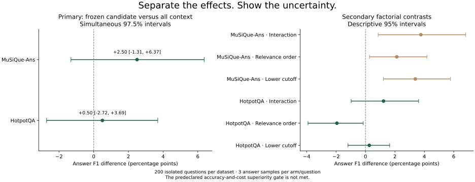
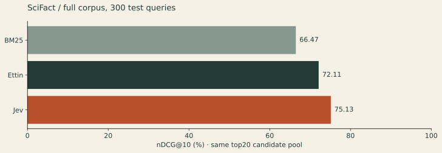
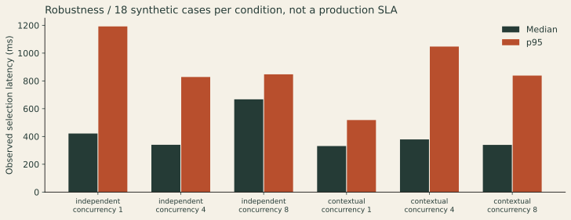
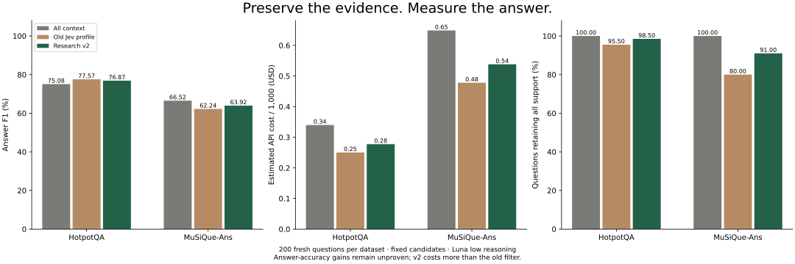
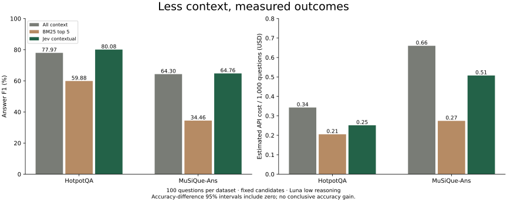
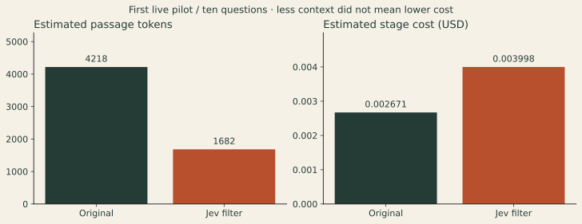

# The rag-jev research notebook

Every study, including regressions and inconclusive results. These studies use different questions and protocols; their sample counts and scores must not be pooled.

Start the app and open `/research` for the visual notebook. [Deploy the service](DEPLOYMENT.md) · [Try your pipeline](REAL_RAG.md)

## 01 · Across the RAG ecosystem

**BEIR · CRAG · FlashRAG · BERGEN · RAGChecker**

Complete FiQA, NFCorpus and SciFact corpora, two retrievers, five selection policies, and 40 CRAG test questions. Jev reranking had higher retrieval point estimates in all six settings; four comparisons with BGE had intervals crossing zero.

CRAG accuracy rose from 30% to 42.5% with reranking, while API cost rose 56.8%. Small samples, same-model judging, and no universal filtering win.

[Report](../benchmarks/ecosystem/RESULTS.md) · [Methods](../benchmarks/ecosystem/README.md) · [Protocol](../benchmarks/ecosystem/protocol.json) · [Data](../benchmarks/ecosystem/results.json)

## 02 · Repeated answers, controlled comparisons

**HotpotQA + MuSiQue · 400 questions · 7,200 evaluation branches**

Isolated source components, three generations per policy and question, a cutoff/order factorial, and an Ettin neural baseline. The frozen candidate used 19.7–22.8% less normalized API cost than all context.

Both primary answer-F1 intervals include zero. The predeclared accuracy-and-cost superiority gate was not met. Supplied candidate sets, not corpus retrieval.

[Report](../benchmarks/research/RESULTS.md) · [Methods](../benchmarks/research/README.md) · [Protocol](../benchmarks/research/protocol.json) · [Data](../src/rag_jev/static/research-v3-results.json)

## 03 · Retrieve first. Then rerank.

**SciFact · all 300 test queries · 5,183 documents**

The same BM25 top20 candidates go to BM25, Jev and Ettin, each returning ten results. nDCG@10: 66.47, 75.13 and 72.11 respectively. No gold passages were inserted.

One dataset, retrieval metrics only. Custom lexical retrieval; possible checkpoint-selection or pretraining exposure. No generated-answer or total-cost superiority claim.

[Report](../benchmarks/research/RETRIEVAL_RESULTS.md) · [Methods](../benchmarks/research/README.md) · [Protocol](../benchmarks/research/retrieval-protocol.json) · [Data](../src/rag_jev/static/retrieval-v1-results.json)

## 04 · Stress the selection layer

**18 synthetic cases · six categories · 108 calls**

Independent and contextual scoring at concurrency 1, 4 and 8. All labeled relevant passages were retained, missing-evidence cases selected no context, and no requests were bypassed.

Synthetic diagnostics, not representative answer accuracy, an SLA, or proof of prompt-injection resistance. No answer generation was evaluated.

[Report](../benchmarks/robustness/README.md) · [Methods](../benchmarks/robustness/README.md) · [Protocol](../benchmarks/robustness/protocol.json) · [Data](../benchmarks/robustness/results.json)

## 05 · Keep the links between passages

**HotpotQA + MuSiQue · 400 new evaluation questions**

A development-selected 0.20 cutoff and relevance ordering were compared with the earlier 0.35 filter and all context. MuSiQue complete evidence retention improved from 80% to 91% versus the old filter.

The more conservative policy cost more than the old filter. Accuracy differences were inconclusive; the predeclared superiority gate was not met.

[Report](../benchmarks/public/RESEARCH_RESULTS.md) · [Methods](../benchmarks/public/RESEARCH.md) · [Protocol](../benchmarks/public/research-v2-protocol.json) · [Data](../src/rag_jev/static/research-v2-results.json)

## 06 · Contextual scoring, first public evaluation

**HotpotQA + MuSiQue · 200 evaluation questions**

Shared-state Jev filtering at a frozen 0.35 cutoff reduced estimated API cost by 23–27% compared with all context, with higher observed answer F1 on both samples.

Both accuracy intervals include zero. MuSiQue support recall fell to 87.67%. One generation per arm; supplied candidates and no modern neural reranker baseline.

[Report](../benchmarks/public/RESULTS.md) · [Methods](../benchmarks/public/README.md) · [Protocol](../benchmarks/public/protocol.json)

## 07 · The first live pipeline

**FastAPI documentation · ten fixed questions**

Fixed lexical retrieval, real Jev selection, and real Luna answers. Estimated passage tokens fell 60.1%, but total stage cost increased 49.7% and inspection found a factual/citation regression.

An integration pilot, not an accuracy benchmark. Eighteen generated answers and two explicit application fallbacks; independent human grading and evidence-recall labels were absent.

[Report](../benchmarks/pilot/RESULTS.md) · [Methods](../benchmarks/pilot/README.md) · [Protocol](../benchmarks/pilot/protocol.json)

## What remains

Full-Wikipedia NQ/TriviaQA/HotpotQA, full BERGEN generation, independent human adjudication and a production shadow trial remain pending. The supplied-page and supplied-candidate studies do not substitute for those evaluations.
